# Dify-Sample
Difyについて学習・調査するためのリポジトリです。

Difyは生成AIのアプリが誰でも簡単に開発できるオープンソースのプロジェクトです。  
一言で言うと最強の複合AIシステム（Compound AI Systems）らしい・・

ワークフロー機能がすごい！！

WebアプリやAPI、チャットアプリで開発できる。

## 開発手順

### 最初から作る

### アプリの種類を選択する

### ワークロードの設定を進めていく

## チャットボットを作成した時の画面キャプチャ

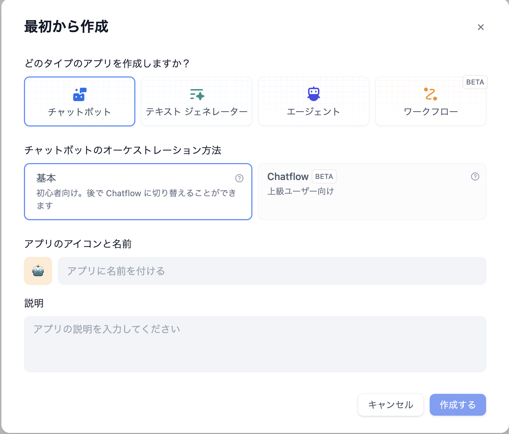
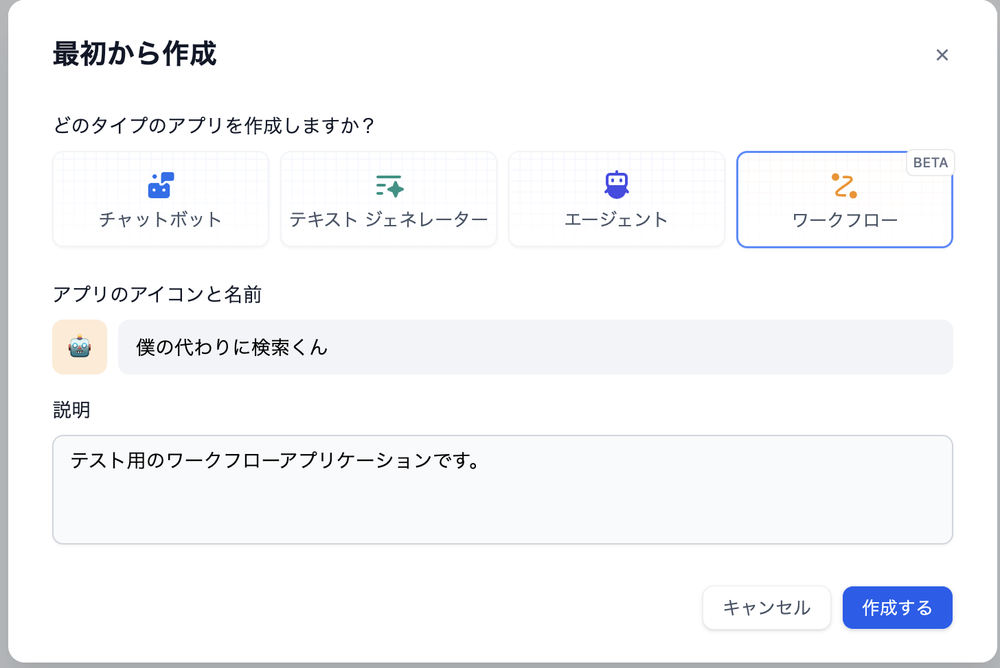

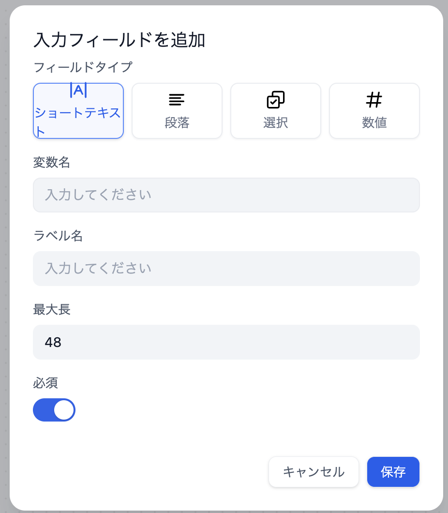
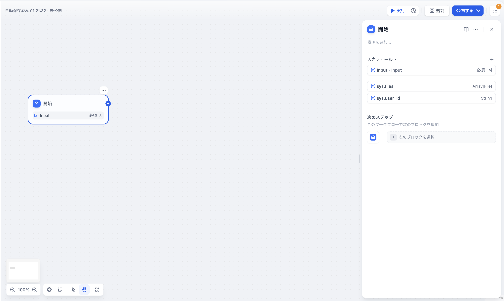
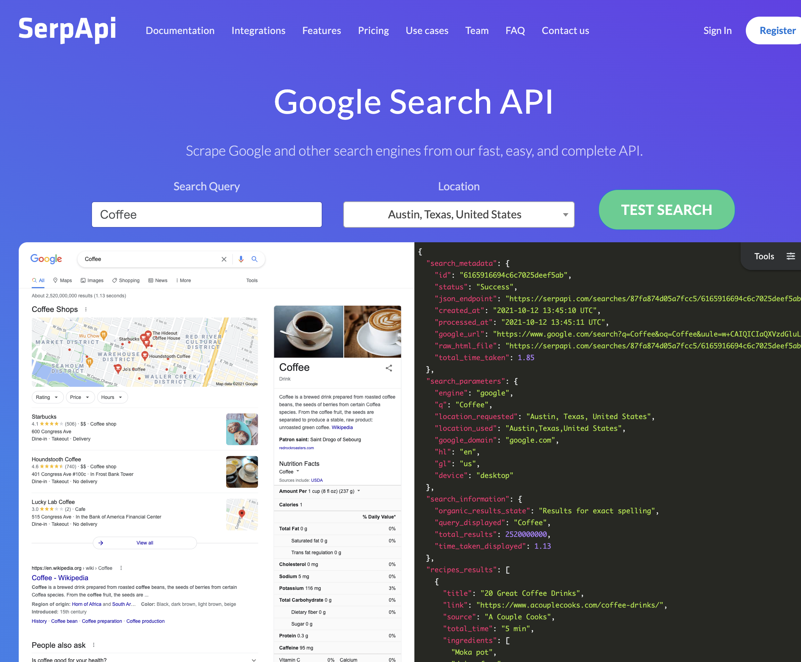
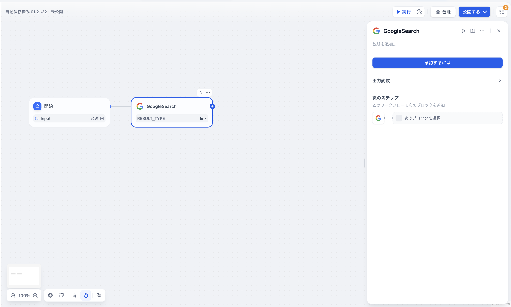
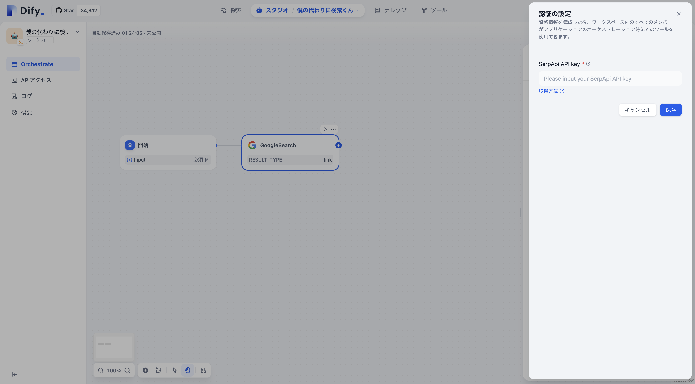
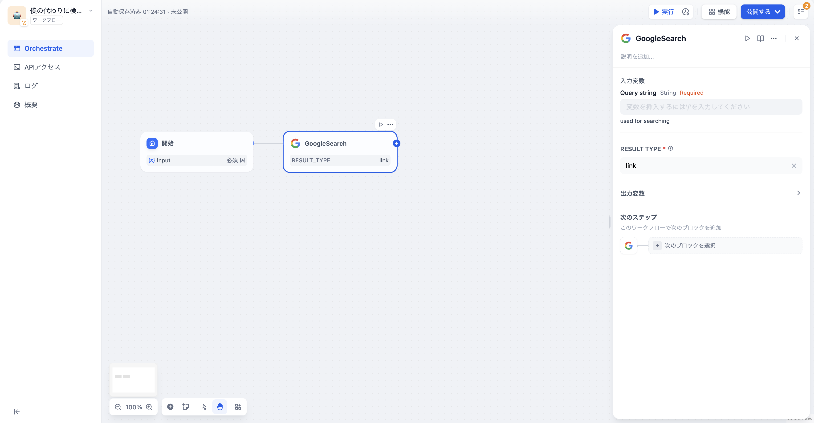
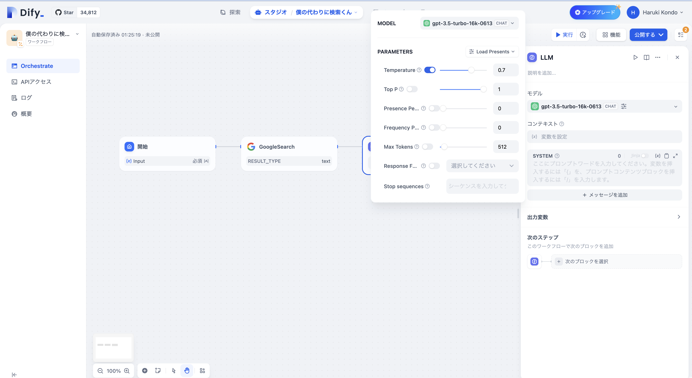
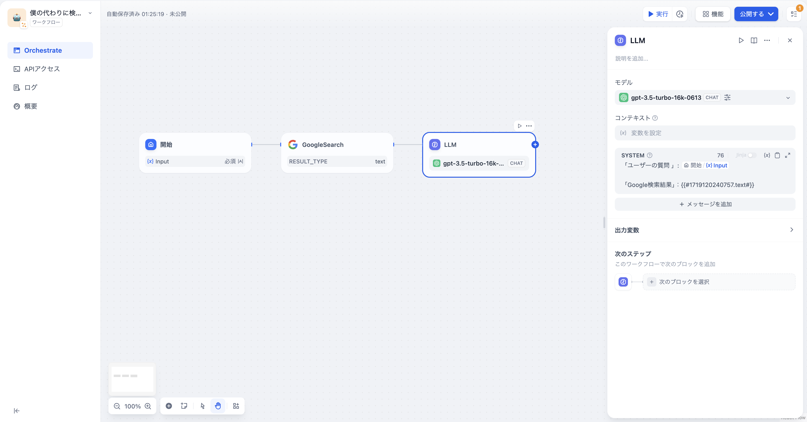
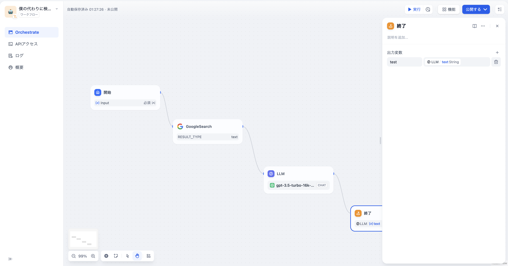
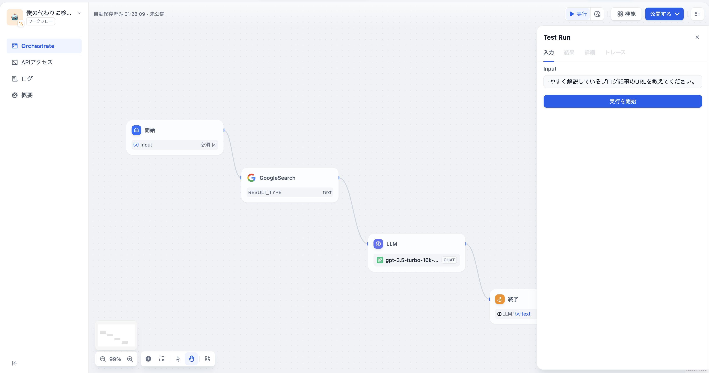
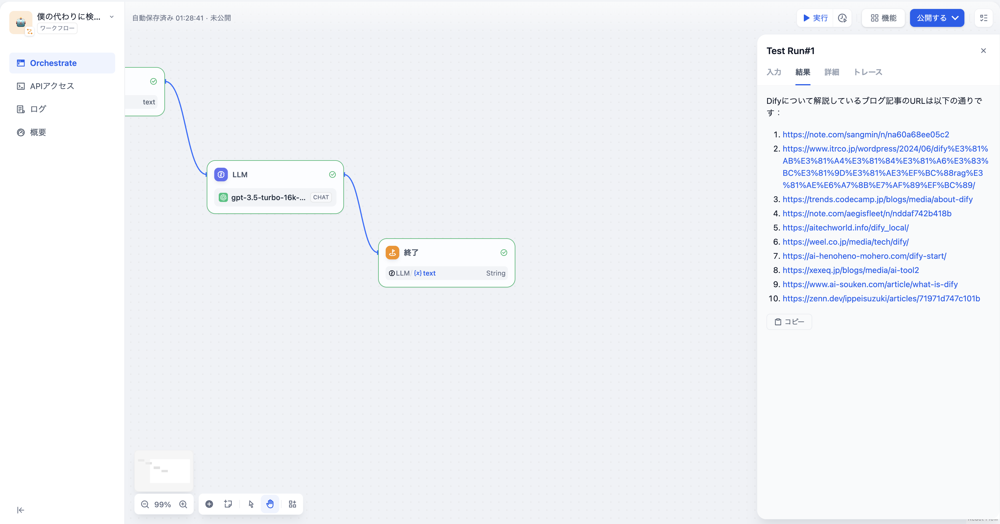

### 参考文献
1. [Dify スタジオ](https://cloud.dify.ai/apps)
2. [DifyをPC(自端末)にインストール](https://zenn.dev/acntechjp/articles/79e4b4abfb2112)
3. [Difyのすごさ](https://zenn.dev/acntechjp/articles/f1eccdb0b32a81)
4. [プログラムのいらないAI開発「Dify」のインパクト](https://gais.jp/dify-impact/)
5. [話題のローコードツール「Dify」で生成AIアプリを作ってみよう！](https://qiita.com/minorun365/items/4c5dba1de7977c386249)
6. [これから Dify の話をします…](https://note.com/sangmin/n/na60a68ee05c2)
7. [Difyについてーその3（RAG情報の構築）](https://www.itrco.jp/wordpress/2024/06/dify%E3%81%AB%E3%81%A4%E3%81%84%E3%81%A6%E3%83%BC%E3%81%9D%E3%81%AE3%EF%BC%88rag%E3%81%AE%E6%A7%8B%E7%AF%89%EF%BC%89/)
8. [【ノーコード自動化AIツール】Difyの使い方｜チャットボットの作り方や料金形態も紹介](https://trends.codecamp.jp/blogs/media/about-dify)
9. [Difyって何ができるの？！すべて無料で生成AIを使ったツールを作ってみた](https://note.com/aegisfleet/n/nddaf742b418b)
10. [Dockerを使ってDify AIをローカル環境で使う方法・メリットを紹介！](https://aitechworld.info/dify_local/)
11. [【Dify】爆速でLLMアプリを開発できる最強ノーコードツール！](https://weel.co.jp/media/tech/dify/)
12. [ノーコードでAIアプリを爆速作成！話題のDifyでチャットボット作ってみた！](https://ai-henoheno-mohero.com/dify-start/)
13. [AIツール「Dify」の使い方や機能、料金などを解説](https://xexeq.jp/blogs/media/ai-tool2)
14. [Difyとは？何ができる？使い方や料金体系、商用利用について徹底解説！](https://www.ai-souken.com/article/what-is-dify)
15. [AIエージェントのみでBPO 企業を作り上げる方法：Dify+Ollama+Llama3+Groqで顧客サポート窓口業務を完全自動化](https://zenn.dev/ippeisuzuki/articles/71971d747c101b)
16. [GitHub - Dify](https://github.com/langgenius/dify)
